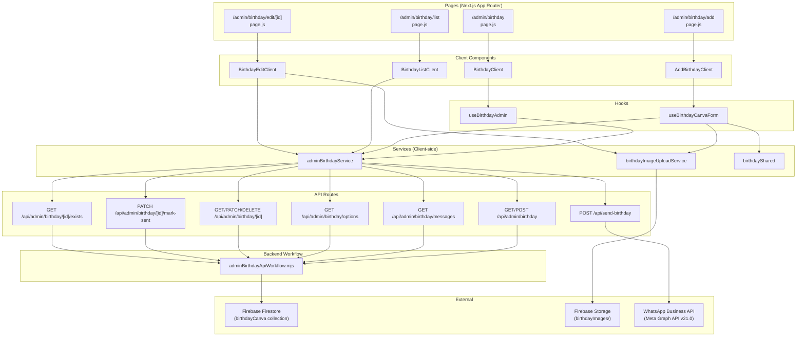

# Birthday Module — Logic & Functionality Analysis

## Overview

The Birthday module is an **admin-facing** feature that manages birthday "creatives" (Canva images) for users and enables sending WhatsApp birthday wishes. It spans **4 routes**, **4 client components**, **2 custom hooks**, **3 services**, **6 API endpoints**, and **1 backend workflow library**.

---

## Architecture Diagram



---

## Route-by-Route Breakdown

### 1. `/admin/birthday` — Birthday Dashboard (Send Messages)

| Layer | File | Key function |
|-------|------|-------------|
| Page | [page.js](file:///c:/KhizarShaikh/Project/UJB_Karma_CC/app/admin/birthday/page.js) | Renders `<BirthdayClient />` |
| Component | [BirthdayClient.js](file:///c:/KhizarShaikh/Project/UJB_Karma_CC/components/admin/birthday/BirthdayClient.js) | Dashboard UI |
| Hook | [useBirthdayAdmin.js](file:///c:/KhizarShaikh/Project/UJB_Karma_CC/hooks/useBirthdayAdmin.js) | Data fetching + send logic |

#### Logic Flow

1. **On mount**, `useBirthdayAdmin` calls `fetchBirthdayUsersForAdmin()` → `GET /api/admin/birthday/messages`
2. The API fetches **all** documents from the `birthdayCanva` Firestore collection
3. For each document with a valid `dob`, it computes the `dayMonth` string (`DD/MM`)
4. **Filters** only users whose birthday is **today** or **tomorrow** (server-side)
5. Returns `{ users, sentIds, today, tomorrow }`
6. On the client, users are split into `todayList` and `tomorrowList` using `useMemo` filtering by `dayMonth`
7. **Stats bar** shows: Today count, Tomorrow count, Sent count

#### Send Birthday Message Flow

1. Admin clicks **Send** button for a user
2. `sendMessage(user)` → calls `sendBirthdayMessage(user)` → `POST /api/send-birthday`
3. The API:
   - Validates payload (requires `user.phone` and `user.name`)
   - Sends WhatsApp template message (`daily_reminder`) to the **user** via Meta Graph API v21.0
     - Header: birthday image (from `user.imageUrl` or placeholder)
     - Body: user name + birthday wish text
   - Looks up the user's **mentor** in `userDetail` collection by phone
   - If mentor found, sends a **second WhatsApp** to the mentor with gender-aware pronoun ("wish him/her/them")
4. On success, calls `markBirthdayMessageSent(userId, today)` → `PATCH /api/admin/birthday/{id}/mark-sent`
5. Updates Firestore document: `{ birthdayMessageSent: true, birthdayMessageSentDate: "DD/MM" }`
6. UI updates `sentMessages` array optimistically

#### UI States per Row

| State | Icon | Label |
|-------|------|-------|
| Pending | `Clock` | "Pending" |
| Sending | `Loader2` (spinning) | "Sending" |
| Sent | `CheckCircle` (green) | "Sent" |

---

### 2. `/admin/birthday/list` — Birthday Canva Status (CRUD List)

| Layer | File | Key function |
|-------|------|-------------|
| Page | [page.js](file:///c:/KhizarShaikh/Project/UJB_Karma_CC/app/admin/birthday/list/page.js) | Renders `<BirthdayListClient />` |
| Component | [BirthdayListClient.js](file:///c:/KhizarShaikh/Project/UJB_Karma_CC/components/admin/birthday/BirthdayListClient.js) | Table listing |

#### Logic Flow

1. **On mount**, calls `fetchBirthdayEntries()` → `GET /api/admin/birthday`
2. API fetches **all** documents from `birthdayCanva` collection (no date filter)
3. Backend serializes each doc via `serializeBirthdayEntry()` (handles Firestore Timestamps)
4. Returns `{ entries: [...] }`
5. Client renders a **paginated table** (10 rows/page) with columns:

| Column | Source | Notes |
|--------|--------|-------|
| Name | `row.name` | |
| Phone | `row.phone` | |
| DOB | `row.dob` | Formatted as `DD Mon` (e.g. "05 May") |
| Upcoming | Computed `getDaysLeft(row.dob)` | "Today" or "X days" |
| Image | `row.imageUrl` | 48x48 rounded thumbnail |
| Action | Delete button | |

#### `getDaysLeft(dob)` Logic

```
1. Parse DOB as Date
2. Create next birthday = same month/day in current year
3. If next birthday < today → advance to next year
4. diffDays = ceil((nextBirthday - today) / ms-per-day)
5. Return "Today" if 0, else "${days} days"
```

#### Delete Flow

1. SweetAlert2 confirmation dialog
2. `deleteBirthdayEntry(id)` → `DELETE /api/admin/birthday/{id}`
3. Backend: `adminDb.collection('birthdayCanva').doc(id).delete()`
4. Client: optimistically removes row from state

#### Pagination

- Client-side only, `PAGE_SIZE = 10`
- `useMemo` computes `paginatedRows` from `rows.slice(start, start + PAGE_SIZE)`
- Prev/Next buttons with page counter

---

### 3. `/admin/birthday/add` — Add Birthday Creative

| Layer | File | Key function |
|-------|------|-------------|
| Page | [page.js](file:///c:/KhizarShaikh/Project/UJB_Karma_CC/app/admin/birthday/add/page.js) | Renders `<AddBirthdayClient />` |
| Component | [AddBirthdayClient.js](file:///c:/KhizarShaikh/Project/UJB_Karma_CC/components/admin/birthday/AddBirthdayClient.js) | Form UI |
| Hook | [useBirthdayCanvaForm.js](file:///c:/KhizarShaikh/Project/UJB_Karma_CC/hooks/useBirthdayCanvaForm.js) | Full form state management |

#### Logic Flow — User Selection

1. **On mount**, loads all users: `fetchBirthdayUserOptions()` → `GET /api/admin/birthday/options`
2. Backend reads `userDetail` collection, maps each doc to `{ label: Name, value: MobileNo, email, photoURL, dob }`
3. User types in search → `filteredUsers` computed via `useMemo` (case-insensitive name match)
4. Clicking a dropdown item sets `selectedUser` = phone number, `search` = user name
5. An `useEffect` also matches exact name input to auto-select

#### Logic Flow — DOB & Duplicate Check

1. When `selectedUser` changes → `setDob(selectedUserData.dob)` (auto-populated from user record)
2. Simultaneously calls `checkBirthdayEntryExists(selectedUser)` → `GET /api/admin/birthday/{phone}/exists`
3. Backend: checks if `birthdayCanva/{phone}` document exists
4. If `existing === true`, save button is **disabled** with label "Creative already exists"

#### Logic Flow — DOB Info Display

1. `dobInfo = getBirthdayDobInfo(dob)` from [birthdayShared.js](file:///c:/KhizarShaikh/Project/UJB_Karma_CC/services/birthdayShared.js)
2. Computes: `{ age: nextBirthdayYear - birthYear, day: weekday name }`
3. Displays: "Turns 30 on Monday" with Cake icon

#### Logic Flow — Image Upload & Save

1. Admin selects image file → `handleFileChange` creates object URL for preview
2. Clicks "Save Birthday Creative" → opens `<ConfirmModal>`
3. On confirm → `handleSave()`:
   - **Validates**: `selectedUserData` + `dob` + `image` must all exist
   - **Uploads image** via `uploadBirthdayImage(phone, imageFile)`:
     - Firebase Storage path: `birthdayImages/{phone}/{timestamp}_{filename}`
     - Uses `uploadBytes()` then `getDownloadURL()`
   - **Saves entry** via `saveBirthdayEntry(payload)` → `POST /api/admin/birthday`
   - Backend creates/overwrites Firestore doc at `birthdayCanva/{phone}`:
     ```json
     {
       "name": "User Name",
       "phone": "91XXXXXXXXXX",
       "email": "user@email.com",
       "dob": "DD/MM/YYYY",
       "dobTimestamp": Date,
       "imageUrl": "https://firebasestorage...",
       "registeredAt": Date
     }
     ```
   - Uses `sanitizeForFirestore()` to clean the data before writing
4. On success: form resets, toast shows success

#### Button States

| Condition | Button Label | Disabled? |
|-----------|-------------|-----------|
| No user selected | "Select a user" | ✅ |
| No DOB | "Date of birth missing" | ✅ |
| Entry exists | "Creative already exists" | ✅ |
| Ready | "Save Birthday Creative" | ❌ |

---

### 4. `/admin/birthday/edit/[id]` — Edit Birthday Creative

| Layer | File | Key function |
|-------|------|-------------|
| Page | [page.js](file:///c:/KhizarShaikh/Project/UJB_Karma_CC/app/admin/birthday/edit/%5Bid%5D/page.js) | Passes `params.id` to component |
| Component | [BirthdayEditClient.js](file:///c:/KhizarShaikh/Project/UJB_Karma_CC/components/admin/birthday/BirthdayEditClient.js) | Edit form |

#### Logic Flow

1. **On mount**, fetches entry: `fetchBirthdayEntry(id)` → `GET /api/admin/birthday/{id}`
2. Backend reads `birthdayCanva/{id}`, returns serialized doc
3. If not found → toast error, renders null
4. Displays read-only info: name, phone, mentor name
5. Editable fields: **Date of Birth** (DateInput), **Replace Image** (file input)

#### Validation

- Only validates `dob` is not empty
- Error message shown via `FormField` error prop

#### Save Flow

1. Clicks "Save Changes" → `<ConfirmModal>` opens
2. On confirm → `handleSave()`:
   - If new image selected: uploads via `uploadBirthdayImage(id, image)` → Firebase Storage
   - If no new image: keeps existing `data.imageUrl`
   - Calls `updateBirthdayEntry(id, { ...data, dob, imageUrl })` → `PATCH /api/admin/birthday/{id}`
   - Backend: `set({ ...payload, updatedAt: new Date() }, { merge: true })` on the Firestore doc
   - Also converts `dob` → `dobTimestamp` via `parseDobInput()` at the API layer

---

## Data Model

### Firestore Collection: `birthdayCanva`

Document ID = user's phone number

| Field | Type | Description |
|-------|------|-------------|
| `name` | string | User's display name |
| `phone` | string | Phone number (also the doc ID) |
| `email` | string | User's email |
| `dob` | string | Date of birth (`DD/MM/YYYY` or `YYYY-MM-DD`) |
| `dobTimestamp` | Timestamp | Parsed DOB as Firestore timestamp |
| `imageUrl` | string | Firebase Storage URL for the birthday Canva image |
| `registeredAt` | Timestamp | When the entry was created |
| `updatedAt` | Timestamp | Last update time (edit only) |
| `birthdayMessageSent` | boolean | Whether WhatsApp message was sent |
| `birthdayMessageSentDate` | string | `DD/MM` format date when message was sent |
| `mentorName` | string | Name of the user's mentor (if populated) |

### Firebase Storage: `birthdayImages/`

```
birthdayImages/
  └── {phone}/
      └── {timestamp}_{filename}
```

---

## Shared Utilities ([birthdayShared.js](file:///c:/KhizarShaikh/Project/UJB_Karma_CC/services/birthdayShared.js))

| Function | Purpose |
|----------|---------|
| `getFormattedDate(offset)` | Returns `DD/MM` string for today+offset days |
| `parseDobInput(dob)` | Parses DOB from `DD/MM/YYYY` (slash-separated) or any `Date`-parseable string |
| `getBirthdayDobInfo(dob)` | Returns `{ age, day }` for the upcoming birthday |

> [!NOTE]
> `parseDobInput` handles both `DD/MM/YYYY` (splits on `/`) and standard date strings (e.g., `YYYY-MM-DD`). This dual format support is critical since DOB data may come in different formats from the user registration process.

---

## Security

All API routes follow the same guard pattern:

```js
function validateAdmin(req) {
  const auth = requireAdminSession(req, hasAdminAccess);
  if (!auth.ok) return { ok: false, response: NextResponse.json(...) };
  if (!adminDb) return { ok: false, response: NextResponse.json(..., 500) };
  return { ok: true };
}
```

> [!IMPORTANT]
> The `POST /api/send-birthday` route (WhatsApp sending) does **NOT** use `validateAdmin`. It has no authentication guard — any caller with access to the server can trigger it. This is a potential security concern.

---

## WhatsApp Integration

- **Template**: `daily_reminder` (pre-approved Meta template)
- **API**: Meta Graph API v21.0 (`graph.facebook.com`)
- **Credentials**: From `serverEnv.whatsapp.{ phoneNumberId, accessToken }`
- **Dual message**: Sends to both the **birthday user** and their **mentor**
- **Gender-aware**: Uses mentor's gender to select pronoun (him/her/them)

---

## Summary of All Files

| File | Purpose |
|------|---------|
| [page.js (birthday)](file:///c:/KhizarShaikh/Project/UJB_Karma_CC/app/admin/birthday/page.js) | Dashboard page shell |
| [page.js (list)](file:///c:/KhizarShaikh/Project/UJB_Karma_CC/app/admin/birthday/list/page.js) | List page shell |
| [page.js (add)](file:///c:/KhizarShaikh/Project/UJB_Karma_CC/app/admin/birthday/add/page.js) | Add page shell |
| [page.js (edit)](file:///c:/KhizarShaikh/Project/UJB_Karma_CC/app/admin/birthday/edit/%5Bid%5D/page.js) | Edit page shell |
| [BirthdayClient.js](file:///c:/KhizarShaikh/Project/UJB_Karma_CC/components/admin/birthday/BirthdayClient.js) | Send WhatsApp dashboard |
| [BirthdayListClient.js](file:///c:/KhizarShaikh/Project/UJB_Karma_CC/components/admin/birthday/BirthdayListClient.js) | CRUD table listing |
| [AddBirthdayClient.js](file:///c:/KhizarShaikh/Project/UJB_Karma_CC/components/admin/birthday/AddBirthdayClient.js) | Create new birthday creative |
| [BirthdayEditClient.js](file:///c:/KhizarShaikh/Project/UJB_Karma_CC/components/admin/birthday/BirthdayEditClient.js) | Edit existing creative |
| [useBirthdayAdmin.js](file:///c:/KhizarShaikh/Project/UJB_Karma_CC/hooks/useBirthdayAdmin.js) | Hook for dashboard data + messaging |
| [useBirthdayCanvaForm.js](file:///c:/KhizarShaikh/Project/UJB_Karma_CC/hooks/useBirthdayCanvaForm.js) | Hook for add form state |
| [adminBirthdayService.js](file:///c:/KhizarShaikh/Project/UJB_Karma_CC/services/adminBirthdayService.js) | Client-side API service layer |
| [birthdayImageUploadService.js](file:///c:/KhizarShaikh/Project/UJB_Karma_CC/services/birthdayImageUploadService.js) | Firebase Storage image upload |
| [birthdayShared.js](file:///c:/KhizarShaikh/Project/UJB_Karma_CC/services/birthdayShared.js) | Date utilities |
| [adminBirthdayApiWorkflow.mjs](file:///c:/KhizarShaikh/Project/UJB_Karma_CC/lib/birthday/adminBirthdayApiWorkflow.mjs) | Server-side Firestore operations |
| [route.js (main)](file:///c:/KhizarShaikh/Project/UJB_Karma_CC/app/api/admin/birthday/route.js) | GET entries, POST new entry |
| [route.js (messages)](file:///c:/KhizarShaikh/Project/UJB_Karma_CC/app/api/admin/birthday/messages/route.js) | GET today/tomorrow birthday users |
| [route.js (options)](file:///c:/KhizarShaikh/Project/UJB_Karma_CC/app/api/admin/birthday/options/route.js) | GET user dropdown options |
| [route.js ([id])](file:///c:/KhizarShaikh/Project/UJB_Karma_CC/app/api/admin/birthday/%5Bid%5D/route.js) | GET/PATCH/DELETE single entry |
| [route.js (mark-sent)](file:///c:/KhizarShaikh/Project/UJB_Karma_CC/app/api/admin/birthday/%5Bid%5D/mark-sent/route.js) | PATCH mark message as sent |
| [route.js (exists)](file:///c:/KhizarShaikh/Project/UJB_Karma_CC/app/api/admin/birthday/%5Bid%5D/exists/route.js) | GET check if entry exists |
| [route.js (send-birthday)](file:///c:/KhizarShaikh/Project/UJB_Karma_CC/app/api/send-birthday/route.js) | POST send WhatsApp messages |
